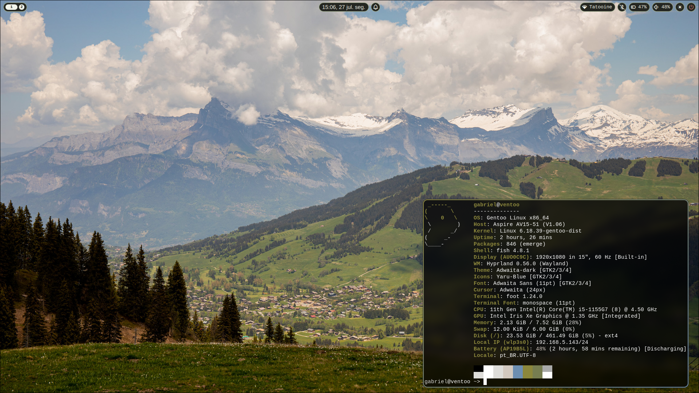
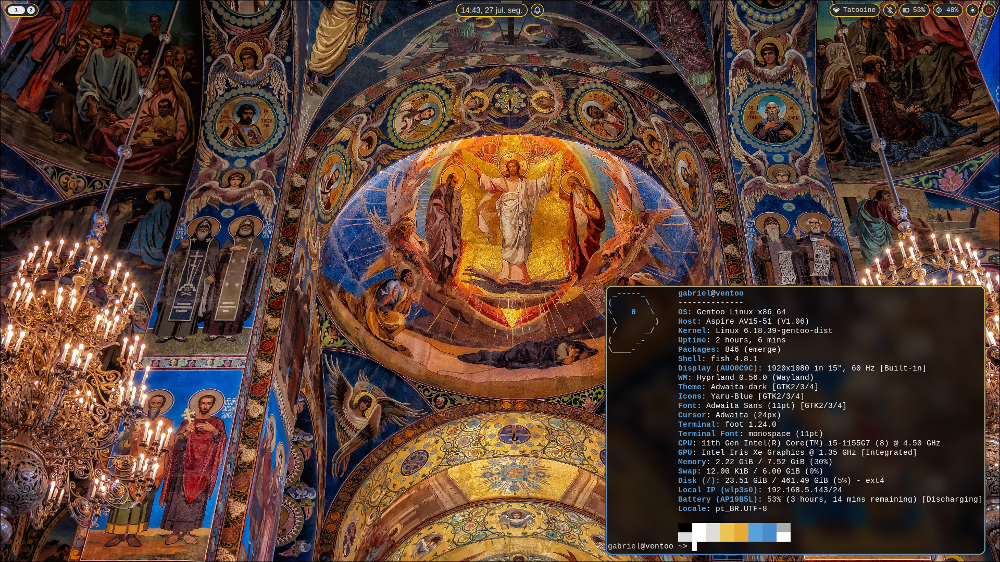
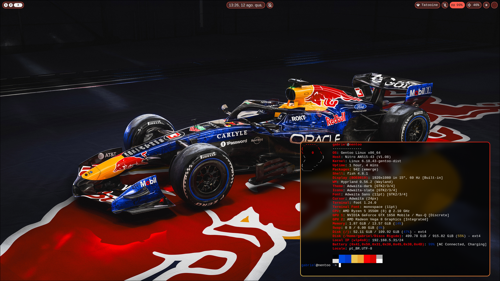
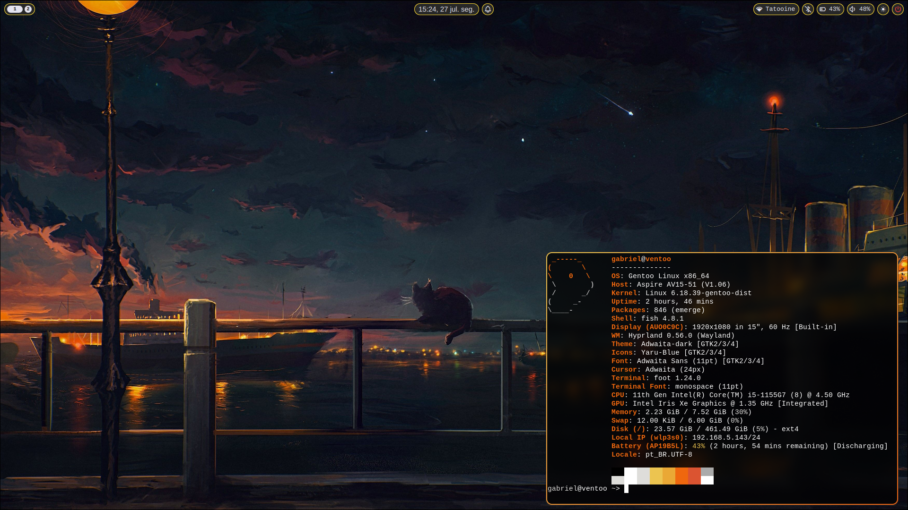
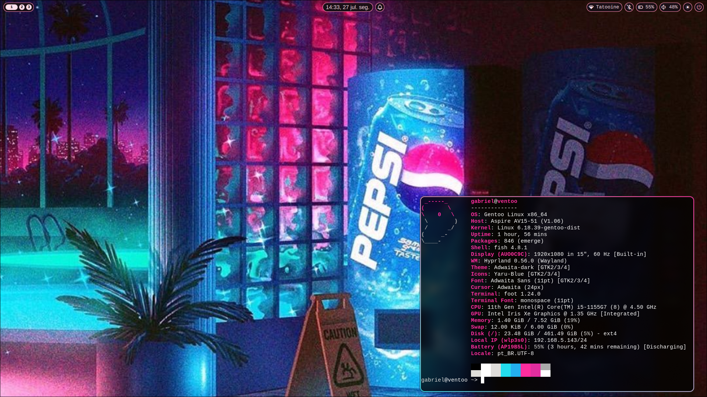
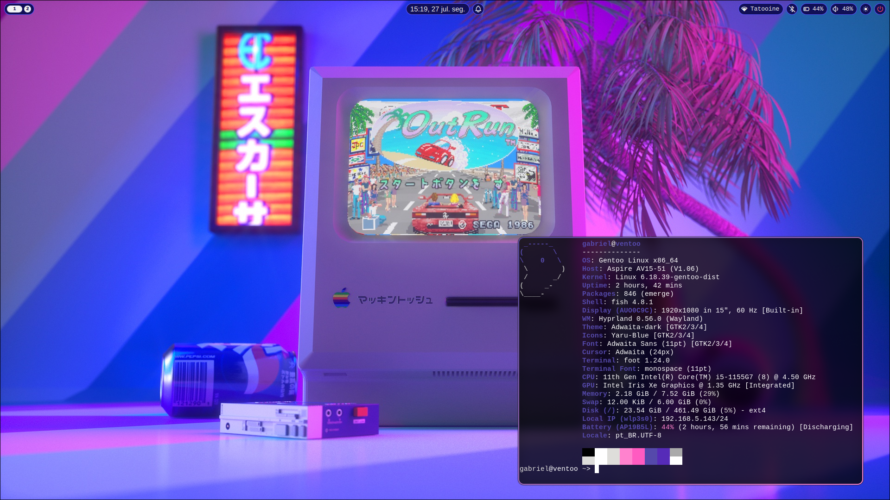

# Sugiura's Gentoo Linux Configuration

This repository contains my personal configuration files for Gentoo,
both are made specifically for my computers, which are an
AV15-51 with an i5-1155G& and a
AN515-43 with an Ryzen 3550H and a GTX 1650 Mobile, only use these Gentoo configurations
if you have exaclty same or an equivalent setup to mine.

If the user wishes to copy only the visual configuration files, just copies the "config"
folder contents to your own ~/.config folder.

## Screenshots

### Nord:

### Rosé Nord:

### Plains:

### Salvation:

### Red Bull

### Low Fire:

### Vaporwave:

### Synthwave:

