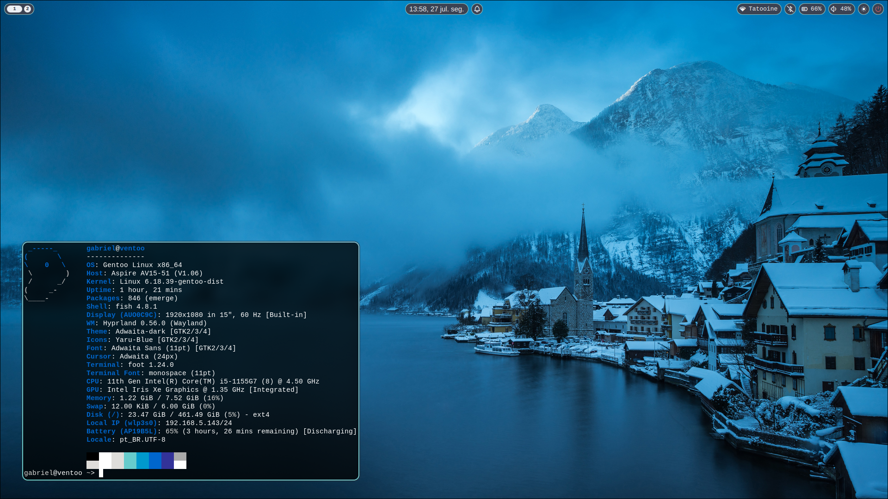
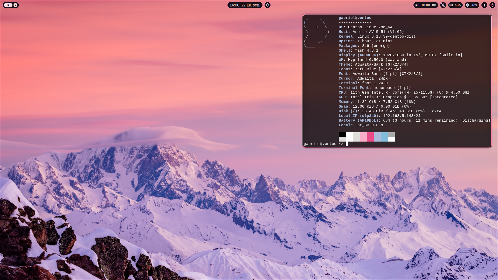

# Gentoo Linux Configuration

This repository contains my personal configuration files for Gentoo,
both are made specifically for my computers, which are an
AV15-51 with an i5-1155G& and a
AN515-43 with an Ryzen 3550H and a GTX 1650 Mobile, only use the Gentoo configurations
if you have exaclty or an equivalent setup to mine.

If the user wishes to copy only the Hyrland and "rice" file, run the install script as non root

## Screenshots

### Nord:

### Rosé Nord:

